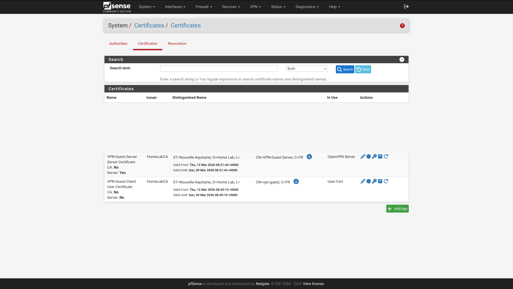
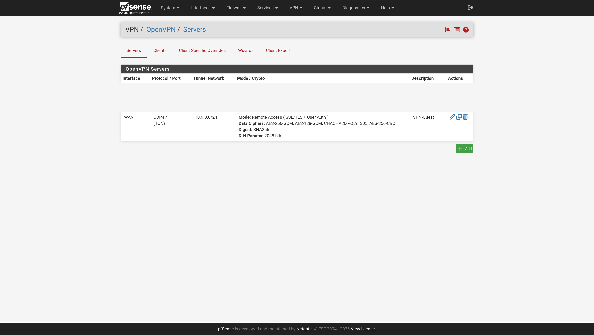
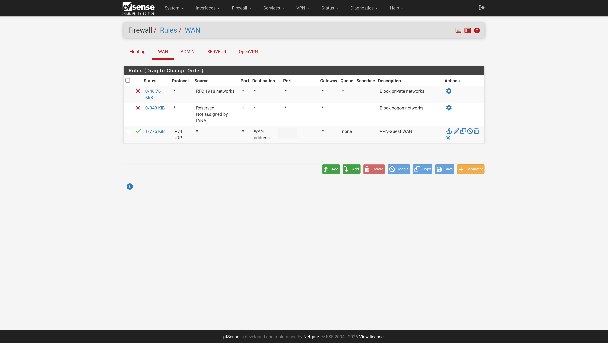
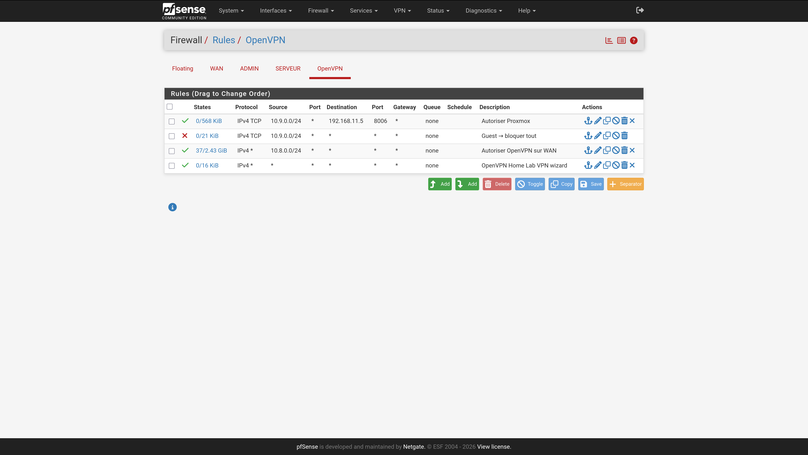
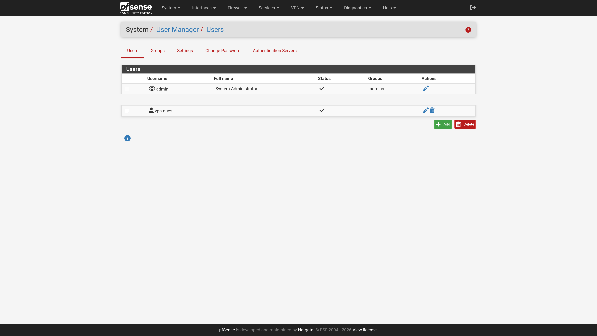
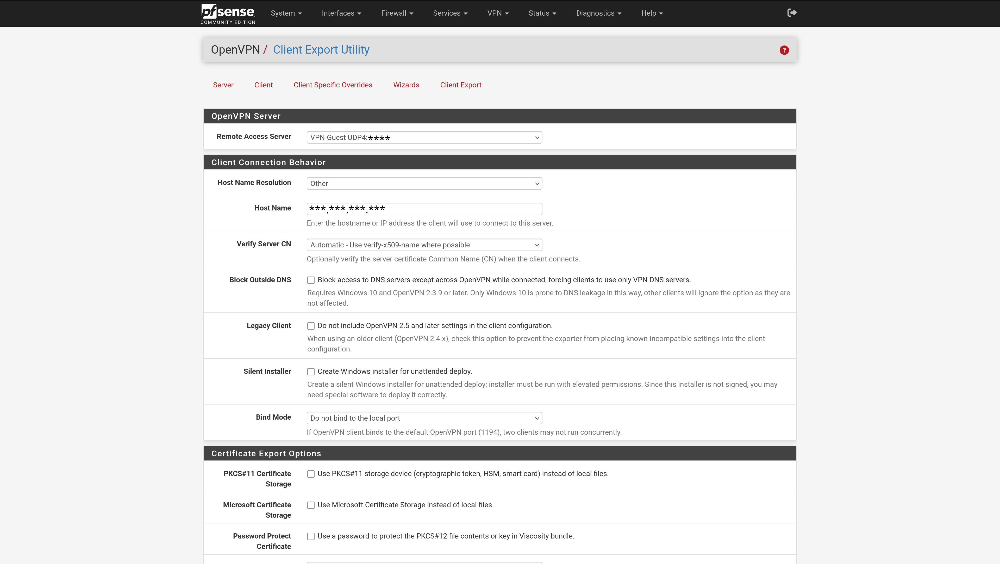
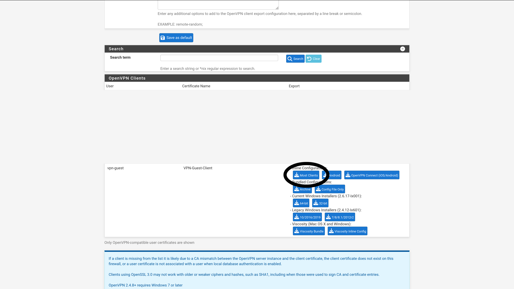
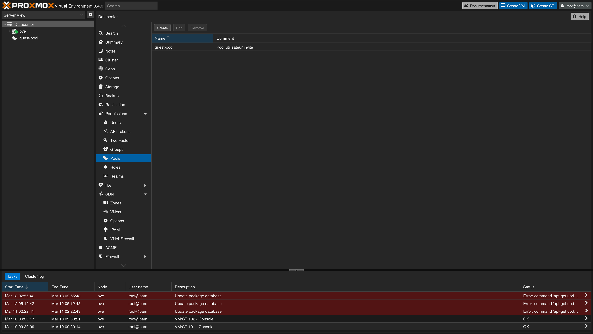
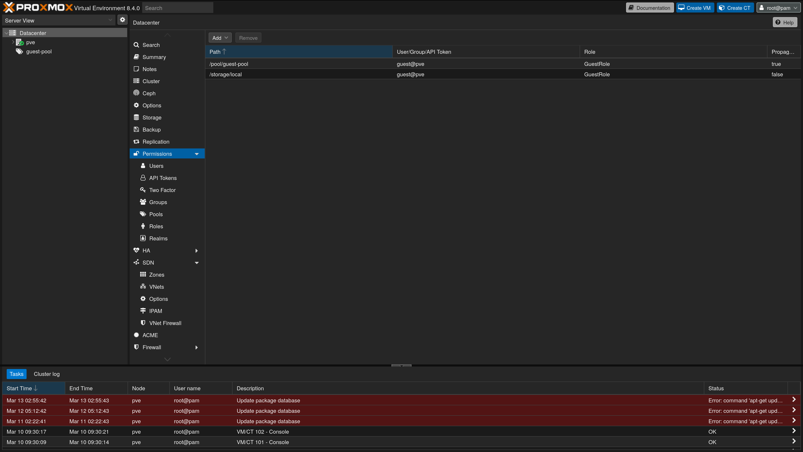
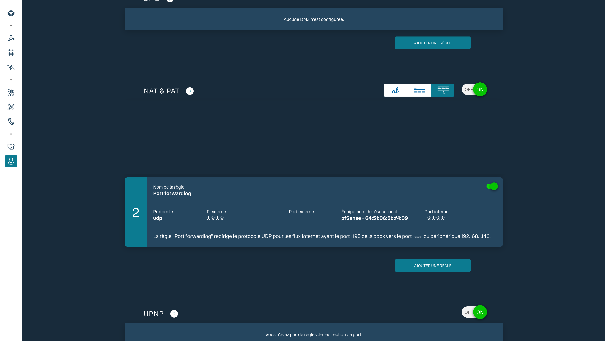

# Guide Complet : Utilisateur Guest Proxmox avec VPN Limité

Ce guide détaille la mise en place d'un accès VPN restreint pour un utilisateur invité, lui donnant accès **uniquement à Proxmox**, avec un compte limité à ses propres VMs.

---

## Étape 1 : Créer le certificat serveur VPN Guest

1. Dans pfSense, allez dans **System → Cert Manager → Certificates → Add/Sign**
2. Remplissez les champs suivants :

| Champ | Valeur |
|---|---|
| Method | Create an internal certificate |
| Descriptive name | VPN-Guest-Server |
| Certificate Authority | HomeLabCA |
| Key type | RSA 2048 |
| Digest Algorithm | SHA256 |
| Certificate Type | Server Certificate |
| Common Name | VPN-Guest-Server |

3. Cliquez sur **Save**

### Page Cert Manager


---

## Étape 2 : Créer le serveur OpenVPN Guest

1. Allez dans **VPN → OpenVPN → Servers → Add**
2. Remplissez les champs suivants :

**General Settings**

| Champ | Valeur |
|---|---|
| Server mode | Remote Access (SSL/TLS + User Auth) |
| Protocol | UDP on IPv4 only |
| Interface | WAN |
| Port | **** |
| Description | VPN-Guest |

**Cryptographic Settings**

| Champ | Valeur |
|---|---|
| Peer Certificate Authority | HomeLabCA |
| Server Certificate | VPN-Guest-Server |
| DH Parameter Length | 2048 |
| Encryption Algorithm | AES-256-CBC |
| Auth Digest Algorithm | SHA256 |

**Tunnel Settings**

| Champ | Valeur |
|---|---|
| Tunnel Network | 10.9.0.0/24 |
| Local Network | 192.168.11.5/32 |

3. Cliquez sur **Save**

### Liste des serveurs OpenVPN


---

## Étape 3 : Règles Firewall WAN

**remplacez `****` par (ex: `1120`)**

Pour autoriser les connexions entrantes sur le nouveau port VPN :

1. Allez dans **Firewall → Rules → WAN → Add**

| Champ | Valeur |
|---|---|
| Action | Pass |
| Protocol | UDP |
| Destination | WAN address |
| Destination Port | **** |
| Description | VPN-Guest WAN |

2. Cliquez sur **Save** puis **Apply Changes**

### Rules WAN


---

## Étape 4 : Règles Firewall OpenVPN

Vous devez créer **2 règles dans cet ordre** pour restreindre l'accès du guest uniquement à Proxmox :

1. Allez dans **Firewall → Rules → OpenVPN → Add**

**Règle 1 — Autoriser Proxmox** (doit être EN HAUT)

| Champ | Valeur |
|---|---|
| Action | Pass |
| Protocol | TCP |
| Source | 10.9.0.0/24 |
| Destination | 192.168.11.5 |
| Destination Port | 8006 |
| Description | Guest → Proxmox uniquement |

**Règle 2 — Bloquer tout le reste** (doit être EN BAS)

| Champ | Valeur |
|---|---|
| Action | Block |
| Protocol | Any |
| Source | 10.9.0.0/24 |
| Destination | any |
| Description | Guest → bloquer tout |

2. Cliquez sur **Save** puis **Apply Changes**

### Rules for proxmox


---

## Étape 5 : Créer l'utilisateur VPN

1. Allez dans **System → User Manager → Users → Add**

| Champ | Valeur |
|---|---|
| Username | vpn-guest |
| Password | (mot de passe robuste) |
| Certificate | VPN-Guest-Client |

2. Cliquez sur **Save**

### Utilisateur VPN


---

## Étape 6 : Exporter le profil VPN client

1. Vérifiez que le package est installé : **System → Package Manager → Installed Packages** → chercher `openvpn-client-export`. S'il n'est pas là, installez-le depuis **Available Packages**.
2. Allez dans **VPN → OpenVPN → Client Export**
3. Sélectionnez le serveur **VPN-Guest (****)**
4. Dans **Host Name Resolution**, choisissez **Other** et entrez votre IP publique : `***.***.***.***`
5. Cliquez sur **Archive** en face de `vpn-guest` pour télécharger le fichier `.ovpn`

### Client Export



---

## Étape 7 : Créer le pool Proxmox

1. Dans Proxmox, allez dans **Datacenter → Pools → Create**

| Champ | Valeur |
|---|---|
| Name | guest-pool |
| Comment | Pool utilisateur invité |

2. Cliquez sur **Add**

### Guest Pool


---

## Étape 8 : Créer le rôle GuestRole

1. Allez dans **Datacenter → Permissions → Roles → Create**
2. Nom : `GuestRole`
3. Cochez uniquement ces permissions :

| Permission | Description |
|---|---|
| `VM.Allocate` | Créer/supprimer des VMs |
| `VM.Config.CDROM` | Monter un ISO |
| `VM.Config.CPU` | Configurer le CPU |
| `VM.Config.Disk` | Configurer les disques |
| `VM.Config.HWType` | Type de matériel |
| `VM.Config.Memory` | Configurer la RAM |
| `VM.Config.Network` | Configurer le réseau |
| `VM.Config.Options` | Options générales |
| `VM.Console` | Accès console |
| `VM.PowerMgmt` | Démarrer/arrêter/redémarrer |
| `Datastore.AllocateSpace` | Utiliser le stockage |
| `Pool.Audit` | Voir son pool |

4. Cliquez sur **Create**

### Liste des rôles avec GuestRole


---

## Étape 9 : Créer l'utilisateur Proxmox

1. Allez dans **Datacenter → Permissions → Users → Add**

| Champ | Valeur |
|---|---|
| User name | guest |
| Realm | pve |
| Password | (mot de passe) |
| Enabled | ✅ |

2. Cliquez sur **Add**

---

## Étape 10 : Assigner les permissions

1. Allez dans **Datacenter → Permissions → Add → User Permission**

**Permission 1 — Accès au pool**

| Champ | Valeur |
|---|---|
| Path | /pool/guest-pool |
| User | guest@pve |
| Role | GuestRole |
| Propagate | ✅ |

**Permission 2 — Accès au stockage**

| Champ | Valeur |
|---|---|
| Path | /storage/local |
| User | guest@pve |
| Role | GuestRole |
| Propagate | ❌ |

2. Cliquez sur **Add** pour chaque permission

---

## Étape 11 : Port forwarding sur la Bbox

1. Accédez à votre Bbox : **http://192.168.1.254**
2. Allez dans **Réseau → NAT & PAT → Ajouter une règle**

| Champ | Valeur |
|---|---|
| Protocole | UDP |
| Port externe | **** |
| Équipement cible | pfSense (192.168.1.146) |
| Port interne | **** |

3. Sauvegardez

### NAT & PAT de la Box


---

## Résultat final

L'utilisateur invité peut désormais :

- ✅ Se connecter au VPN avec le fichier `.ovpn` et ses identifiants
- ✅ Accéder à Proxmox sur `https://192.168.11.5:8006` avec `guest@pve`
- ✅ Voir uniquement son pool `guest-pool`
- ✅ Créer et gérer ses propres VMs
- ❌ Accéder à vos autres machines (K3s, PostgreSQL, TrueNAS...)
- ❌ Voir vos VMs existantes (100, 101, 102)

---

### Aide au diagnostic

En cas de problème de connexion VPN, lancez cette commande sur le client :

```bash
sudo openvpn --config /chemin/vers/vpn-guest.ovpn
```

- **TLS handshake failed** → Vérifier la règle WAN sur pfSense (port **** UDP autorisé)
- **Auth failed** → Vérifier le nom d'utilisateur et mot de passe
- **Cannot reach Proxmox** → Vérifier l'ordre des règles dans Firewall → Rules → OpenVPN

Consultez aussi les logs pfSense : **Status → System Logs → OpenVPN**